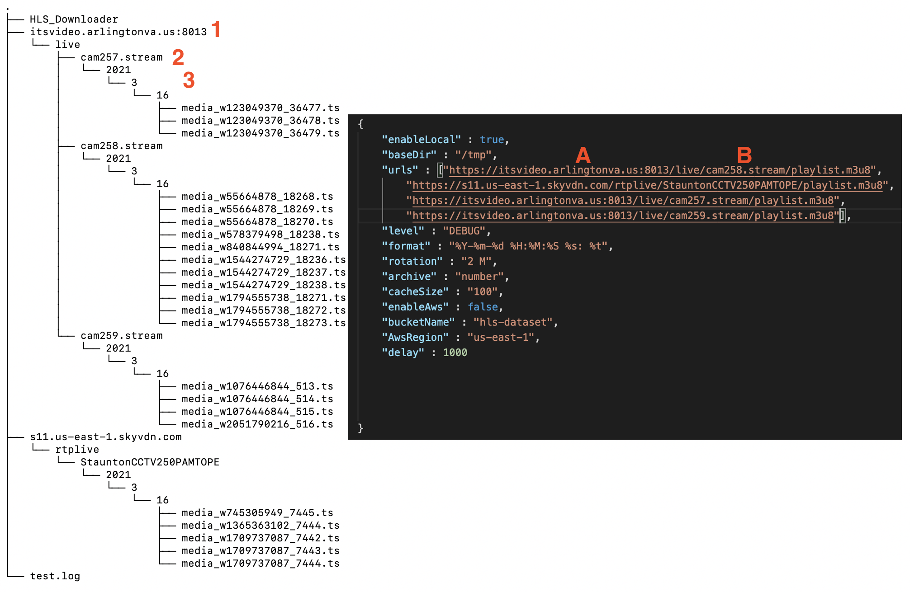

# HLS_Downloader
HLS Downloader is a C++ application that downloads media files from servers that use the HTTP Live Streaming (HLS) Protocol.
An example use is accessing and saving footage from desired traffic cameras in Arlington, Virginia. The application can also upload directly to AWS S3 buckets. This could be useful for potential machine learning applications.

Specific camera links can be plugged into the configuration file (explained [below](#configuration))

[County of Arlington, Virginia](https://transportation.arlingtonva.us/live-traffic-cameras/)
#### Example Camera Links
| Camera Location | URL |
| ----------- | ----------- |
| Glebe Road at Carlin Springs | https://itsvideo.arlingtonva.us:8013/live/cam181.stream/playlist.m3u8 |
| Route 50 @ Patrick Henry | https://itsvideo.arlingtonva.us:8013/live//cam23.stream/playlist.m3u8 |
#### State Websites
[Virginia Department of Transportation](https://www.511virginia.org/)
| Camera Location | URL |
| ----------- | ----------- |
| I-95 / MM 138.6 / SB |https://s16.us-east-1.skyvdn.com/rtplive/FairfaxVideo2065/playlist.m3u8 |
| US-250 / WB / SR-20 / Charlottesville | https://s11.us-east-1.skyvdn.com/rtplive/StauntonCCTV250PAMTOPE/playlist.m3u8 |

## Dependencies:
* AWSSDK
    Provides an API to access Amazon Web Services Simple Storage Service (S3)

    ```
    git clone https://github.com/aws/aws-sdk-cpp.git
    mkdir sdk_build
    cmake -DCMAKE_BUILD_TYPE=Release -DBUILD_ONLY="s3"
    make install
    ```
* Poco 
    This library provides HTTP, logging, and JSON parsing support required by HLS Downloader

    ```
    $ git clone https://github.com/pocoproject/poco.git
    $ cd poco
    $ mkdir cmake-build
    $ cd cmake-build
    $ cmake ..
    $ make install
    ```

* OpenSSL
    Library required by Poco for HTTP support.
    * Follow instructions here https://github.com/openssl/openssl
* Boost 
    The boost::filesystem library is used for various I/O operations.
    * Download from https://www.boost.org/
* GTest
    Provides testing framework.
    
    ```
    git clone https://github.com/google/googletest.git
    cd googletest        
    mkdir build          
    cd build
    cmake ..             
    make
    sudo make install    
    ```
## Design
The following sequence diagram illustrates how the Driver class interacts with other classes to iterate over all camera URLs specified in the `config.json` file.


When the application is run, with `enableLocal` set to `true`, the following directory structure will be created for the specified configuration.

The top level directory labeled `"1"` corresponds to the portion of the url labeled `"A"` in the illustrated configuration file. Similarly, the directory labeled `"2"` corresponds to the name of the camera, labeled `"B"`.


## How To Run the Application
When you open the Udacity Virtual Machine, the required packages will already be downloaded. However, you will still need to run "make install" in each build directory as shown below. The default configurations have AWS off, but you may enable it if you have your own credentials.

##### Aws build
From home/workspace:
```
cd aws-sdk-cpp
cd build
make install
```


##### Poco Build
From home/workspace:

```
cd poco
cd cmake-build
make install
```


##### GTeest Build

From home/workspace:
```
cd googletest
cd build
make install
```

Navigate to the terminal and build the project.
From home/workspace/HLS_Downloader:
```
cd build
cmake ..
make
```


You can now run the project as shown below. The only argument the program takes is the path to the configuration file. A default file is provided at `"../config/config.json"`:
From home/workspace/HLS_Downloader/build:

```
cd ../
cd bin
./HLS_Downloader ../config/config.json
```

Allow the projct to run as long as you would like. The longer it runs, the more footage it saves.

Under the bin directory you will see a path that leads to the video files.

## How To Run the Tests
You can run the tests by running the HLS_Downloader_test executable. The program creates its own server to run the HTTP tests.

## Configuration
Under the /config directory, there is a file named "config.json". The following variables can be modified depending on how you would like the program to run.
* enableLocal - Determines whether or not to save media files locally
* baseDir - Sets base directoy
* urls - List of urls for each traffic camera to access
* level - Sets level for logger
* format - Sets format for logger
* rotation - Sets max file size for log files
* cacheSize - Sets size of cache for duplicate file detection
* enableAws - Determines whether or not to save media files to Amazon Web Services (set to false if you do not have an AWS key)
* bucketName - Name of s3 bucket
* AwsRegion - Region of AWS bucket
* delay - Time between executions of main loop in milliseconds. Note: A delay that is too large may result in missed media files

## Rubric Items
                              
|Criteria| File(s)| Line|
|--------|-----|-----|
|"The project uses Object Oriented Programming techniques."|  , | All|
|"Classes use appropriate access specifiers for class members."| , , , | All|
|"The project reads data from a file and process the data, or the program writes data to a file."| | 24|
|"Derived class functions override virtual base class functions." | | 7|
|"The project uses smart pointers instead of raw pointers."|  |19
|"The project uses multithreading."| | 74
|"A mutex or lock is used in the project."| | 93|
|"The project makes use of references in function declarations."| , | 4, 24|
|"A condition variable is used in the project."|| 85|

## Memory Leak Analysis

The program was confirmed to be free from memory leaks by the Leaks tool available on MacOS through XCode as shown in the following image.


